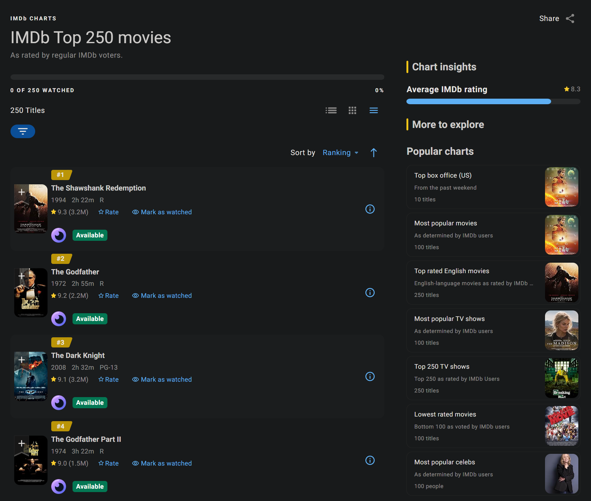
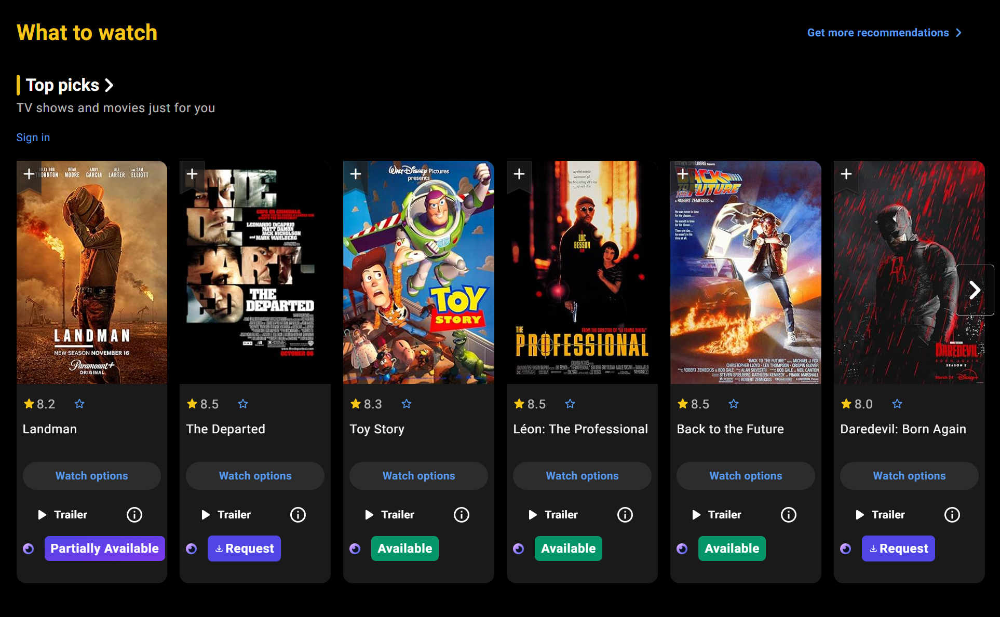

# Seerr Assistant

Chrome Web Store Page: <https://chromewebstore.google.com/detail/seerr-assistant/idjoapfabmkojbhifbkjcdbmnohijdib>

Firefox Add-On Page: <https://addons.mozilla.org/en-US/firefox/addon/seerr-assistant/>

Seerr Assistant is a browser extension for [Seerr](https://github.com/seerr-team/seerr)

Features:
- One-click Seerr requests directly from media websites
- Monitor requests status
- Support for both movies and TV shows
- Support for Jellyfin login credentials through Seerr

Supported media websites:
- [IMDb](https://www.imdb.com/)
- [TMDB](https://www.themoviedb.org/)
- [TVDB](https://thetvdb.com/)

## Install

## Screenshots

### IMDb

### TMDB

## License

Seerr Assistant is licensed under the [MIT License](LICENSE).
